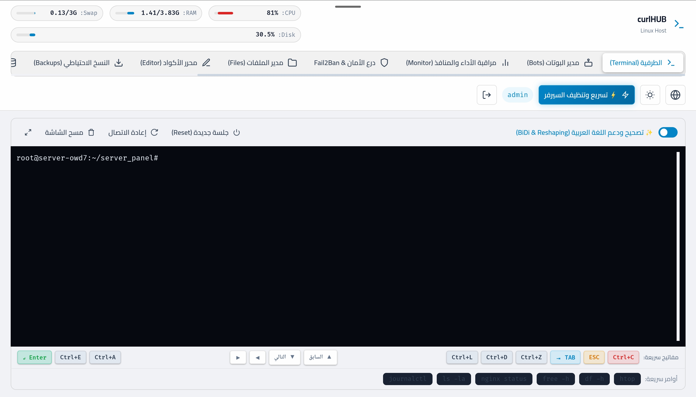
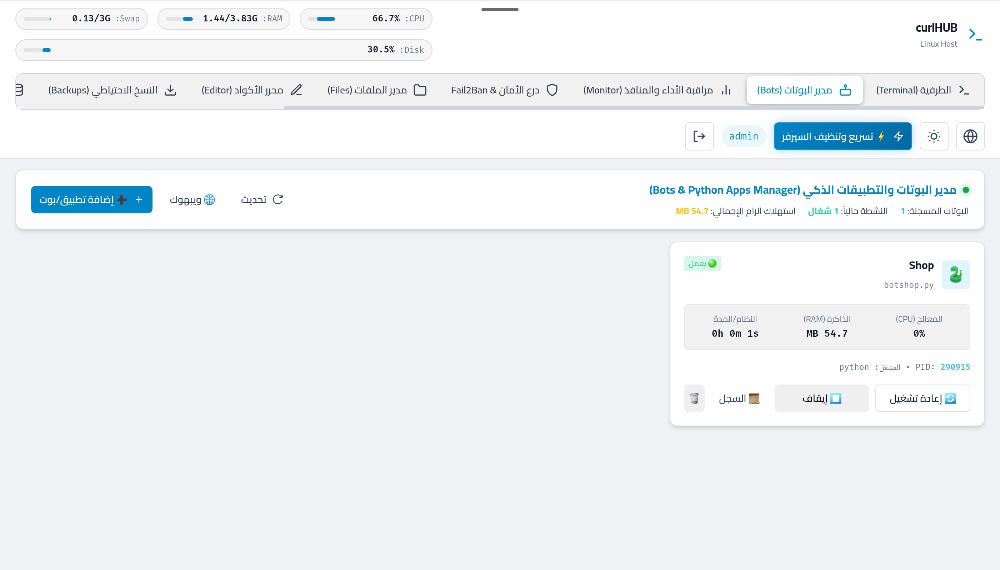

# 🚀 curlHUB

[](https://opensource.org/licenses/MIT)
[](https://www.python.org/)
[](https://fastapi.tiangolo.com/)

[عربي 🇸🇦](README_AR.md) | [English 🇬🇧](README.md)

An advanced, all-in-one platform for managing Linux servers via the browser. Built with **FastAPI**, **Vanilla JS (Glassmorphism)**, and **Xterm.js**, offering unparalleled performance, security, and unique features like intelligent Arabic (RTL) text rendering in the terminal.


## ✨ Features



- 💻 **Persistent Web Terminal:** Zero-disconnect PTY sessions. Run long tasks, close the browser, and resume later! Features an intelligent Arabic BiDi & Reshaping engine.


- 🤖 **Smart Bots Manager:** Auto-detects Python/PHP Telegram bots. Start, stop, and restart with 1-click. View live console logs.
  - **Auto Venv & Requirements:** Automatically detects `.venv` environments. If `requirements.txt` is found, it offers 1-click installation.
  - **Webhooks & Polling:** Native PHP-CGI execution for Webhook bots via FastAPI proxy. Auto-resolves Webhook/Polling conflicts.
  - **Zombie Reaper:** Automatically cleans up orphaned/zombie processes when stopping bots.
- 🛡️ **Security Shield:** Built-in UFW & Fail2Ban GUI. Contains 21 Honeypot Traps to instantly ban vulnerability scanners (SQLMap, Nmap, etc.).
- 📊 **System Monitor:** Real-time RAM, CPU, Swap, and listening ports monitor. Includes a 1-click Server Booster to clean RAM/Cache.
- 📁 **File Manager & IDE:** Drag & drop file manager with an integrated Ace Code Editor (Syntax highlighting for 20+ languages).
- 💾 **1-Click Backups:** Backup your databases, apps, or the panel itself into `.tar.gz` instantly.
- 🗄️ **SQLite Studio:** Auto-discover `.db` files, view tables, and run interactive SQL queries.
- 🔔 **Telegram Alerts:** Instant push notifications to your phone when an IP is banned or an app crashes.

## 📦 Installation (1-Click)

Run the following commands as `root` on an Ubuntu/Debian server:

```bash
git clone https://github.com/mosap111/curlHUB---panel-.git /opt/curlHUB
cd /opt/curlHUB
chmod +x install.sh
sudo ./install.sh
```

## 🔑 Default Credentials
After installation, visit `http://YOUR_SERVER_IP` in your browser.
- **Username:** `admin`
- **Password:** `admin123456`

> **⚠️ IMPORTANT:** Change your password from the UI settings immediately after your first login!

## 📜 License
This project is licensed under the [MIT License](LICENSE).
