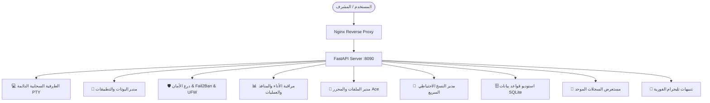

# 🚀 curlHUB - لوحة تحكم وإدارة السيرفر
[](https://opensource.org/licenses/MIT)
[](https://www.python.org/)
[](https://fastapi.tiangolo.com/)

[عربي 🇸🇦](README_AR.md) | [English 🇬🇧](README.md)

> **⚠️ ملاحظة:** تم إضافة الصور والشاشات قريباً.
> 


## Server Console, Security Shield & Application Management Platform

---

### 🌐 1. نظرة عامة على المنصة (Platform Architecture & Overview)

منصة متكاملة ومتقدمة لإدارة وخوادم لينكس سحابياً عبر المتصفح بأعلى مستويات الأداء والأمان وسلاسة الاستخدام، مع دعم استثنائي للغة العربية في الطرفية، وتحصين دفاعي شامل ضد كافة أنواع الهجمات والتخمين.

* **عنوان اللوحة:** [http://YOUR_SERVER_IP](http://YOUR_SERVER_IP) (أو محلياً عبر المنفذ `8090`).
* **المسار البرمجي في السيرفر:** `/root/server_panel`
* **المكونات الأساسية:**
  * **الخلفية البرمجية (Backend):** Python 3.13, FastAPI, Uvicorn, Asyncio, PTY (Pseudo-Terminal Engine), Psutil, SQLite3, Fail2Ban / UFW Integration.
  * **الواجهة الأمامية (Frontend):** Modern Vanilla JavaScript (ES6+), Modern Dark Glassmorphism CSS, Xterm.js 5.5, Ace Editor 1.32.
  * **محرك معالجة اللغة العربية:** محرك مخصص ثنائي الاتجاه (BiDi & Arabic Reshaping Engine) لربط وتصحيح الحروف والكلمات العربية في الطرفية.
  * **خادم الويب والبروكسي العكسي (Proxy):** Nginx مع إعدادات WebSocket الدائمة (مهلة اتصال 24 ساعة).

---

### 🛠️ 2. تفصيل الأقسام والميزات الشاملة



---

#### 💻 1. الطرفية السحابية التفاعلية (Persistent Web Terminal)
1. **دعم اللغة العربية الكامل والتلقائي (BiDi & Arabic Reshaper):**
   * حل جذري لمشكلة الحروف المعكوسة والمتقطعة في سطر الأوامر عبر خوارزمية ذكية لربط الحروف وعكس اتجاه الكلمات العربية فقط مع الحفاظ على الأوامر الإنجليزية والأرقام من اليسار لليمين.
2. **جلسات طرفية دائمة (Persistent PTY Sessions & Zero Disconnect):**
   * جلسة صدفة `bash` تعمل بشكل دائم في خلفية السيرفر (`PersistentPtySession`).
   * عند إغلاق المتصفح أو انقطاع الاتصال، **لا تتوقف الأوامر قيد التشغيل**.
   * عند العودة، يتم بث كامل سجل المخرجات السابقة فوراً (`Scrollback Buffer Replay`).
3. **شريط مفاتيح واختصارات الطرفية السريعة (Virtual Terminal Keypad):**
   * أزرار مخصصة للتحكم السريع بضغطة زر (Ctrl+C, ESC, TAB ⇥, Ctrl+Z, Ctrl+D, Ctrl+L, الأسهم، و Enter).

---


#### 🤖 2. مدير البوتات والتطبيقات الذكي (Bots & Python Apps Manager)
1. **الرصد التلقائي للخدمات:**
   * رصد مشاريع بايثون وتطبيقات تليجرام في السيرفر تلقائياً (`yms_bot`, `yms_app`, `shop_bot`).
2. **التحكم والتشغيل اللحظي:**
   * تشغيل (`Start`)، إيقاف (`Stop`)، وإعادة تشغيل (`Restart`) أي تطبيق أو بوت بنقرة زر.
3. **شاشة المراقبة اللحظية:**
   * إظهار استهلاك المعالج (% CPU)، والذاكرة (RAM MB)، والـ PID، ومدة العمل المستمر (Uptime).
4. **مستعرض السجلات الحية (Live Console Logs):**
   * نافذة لمتابعة مخرجات الكونسول والرسائل والأخطاء لكل بوت بشكل مباشر دون الحاجة لفتح الطرفية.
5. **تسجيل بوتات جديدة:**
   * إمكانية إضافة أي مشروع أو سكريبت جديد بسهولة مع تحديد بيئة البايثون (`venv`) ومسار العمل.

---

#### 🛡️ 3. درع الأمان الشامل ومراقبة الهجمات (Security Shield & Fail2Ban)
1. **التكامل المباشر مع سجون النظام (System Fail2Ban GUI):**
   * مراقبة السجون النشطة (`sshd`, `recidive`, `nginx-botsearch`, `nginx-bad-request`, `nginx-limit-req`).
   * عرض عدد المحاولات الفاشلة وعدد المحظورين في كل سجن.
   * جدول شامل لعناوين الـ IP المحظورة مع زر فك حظر فوري (`Unban`).
2. **درع مصائد المسارات الحساسة (21 Honeypot Traps):**
   * مصائد لمسارات الفحص المشبوهة (`/.env`, `/.git`, `/phpmyadmin`, `/shell.php`, `/wp-config`, وغيرها) وحظر المهاجم فور محاولته الوصول إليها.
3. **حظر أدوات الفحص والاختراق (Scanner User-Agents Blocker):**
   * كشف وحظر فوري لأدوات: `gobuster`, `sqlmap`, `nikto`, `dirbuster`, `ffuf`, `wpscan`, `nuclei`, `nmap` وغيرها.
4. **حماية التخمين (Brute-Force Protection):**
   * حظر تلقائي بعد 5 محاولات دخول خاطئة للوحة، وحظر على مستوى كيرنل النظام لـ SSH.

---

#### 📊 4. مراقبة الأداء والمنافذ والعمليات (System Monitor & Ports)
1. **دقة 100% في قراءة الموارد:**
   * رصد حي لاستهلاك المعالج، الذاكرة العشوائية، Swap، والمساحة التخزينية.
2. **مراقبة وإدارة المنافذ (Listening Ports):**
   * كشف المنافذ المفتوحة والمستمعة والتمييز اللوني بين المنافذ العامة `0.0.0.0 (🌐)` والمحلية `127.0.0.1 (🔒)`.
3. **إدارة خدمات النظام (Systemd Services):**
   * تشغيل، إيقاف، وإعادة تشغيل خدمات النظام الأساسية.
4. **زر تسريع وتنظيف السيرفر بضغطة واحدة (⚡ 1-Click Server Booster):**
   * تفريغ كاش الذاكرة، مسح السجلات القديمة، تنظيف كاش الحزم، وإظهار الميجابايت المستعادة.

---

#### 📁 5. مدير الملفات ومحرر الأكواد (File Manager & Ace Code Editor)
1. **تصفح ورفع الملفات:**
   * تصفح سلس بالسحب والإفلات (Drag & Drop)، رفع وتحميل وحذف وإعادة تسمية الملفات.
2. **محرر أكواد مدمج (Ace Editor):**
   * تلوين وتنسيق الأكواد (Syntax Highlighting) لأكثر من 20 لغة برمجية مع اختصارات الحفظ السريع `Ctrl + S`.

---

#### 💾 6. مدير النسخ الاحتياطي السريع (Backups & Disaster Recovery)
1. **أخذ نسخ احتياطية بنقرة واحدة (1-Click Presets):**
   * نسخ بوت المتجر (`Shop`)
   * نسخ مشروع `YMS Project`
   * نسخ كافة قواعد بيانات SQLite في السيرفر
   * نسخ كود لوحة التحكم
2. **التنزيل المباشر:**
   * تحميل أرشيف النسخ الاحتياطية `.tar.gz` مباشرة إلى جهاز الكمبيوتر أو الهاتف.
3. **الحذف والإدارة:**
   * إدارة وتتبع تواريخ وأحجام النسخ الاحتياطية بسهولة.

---

#### 🗄️ 7. مستعرض واستوديو قواعد البيانات (SQLite Studio)
1. **اكتشاف تلقائي لقواعد البيانات:**
   * مسح واستعراض كافة ملفات SQLite في السيرفر.
2. **استعراض الجداول والهيكل:**
   * عرض الأعمدة، الأنواع، المفاتيح الأساسية (PK)، وعدد الصفوف في كل جدول.
3. **تنفيذ استعلامات SQL تفاعلية:**
   * كتابة وتنفيذ استعلامات SQL مخصصة وعرض النتائج في جدول تفاعلي مع قياس سرعة التنفيذ بالميلي ثانية.

---

#### 📜 8. مستعرض السجلات الموحد (Unified Real-Time Log Viewer)
* شاشة موحدة لمتابعة وبحث وفلترة سجلات:
  * سجلات وصول Nginx (Access Logs)
  * سجلات أخطاء Nginx (Error Logs)
  * سجلات حظر Fail2Ban
  * سجلات توثيق وأمان SSH
  * سجلات نواة النظام (Kernel/Dmesg)

---

#### 🔔 9. نظام إشعارات وتنبيهات تليجرام (Telegram Alert Notifications)
* ربط اللوحة مع بوت تليجرام لإرسال تنبيهات فورية عند:
  * صد هجوم أو حظر عنوان IP مشبوه.
  * توقف أو تعطل أي بوت في السيرفر.
  * زر تجربة إرسال تنبيه للتأكد من نجاح الربط.

---


#### 🤖 10. الإدارة الذكية للبوتات (Smart Bot Management - الجديد ✨)
1. **التعرف التلقائي على بيئات التشغيل (Auto Venv Detection):**
   * بمجرد إدخال مسار سكربت البايثون، تكتشف اللوحة مجلد `.venv` تلقائياً.
2. **تثبيت المكاتب آلياً (Auto Dependency Installer):**
   * في حال وجود `requirements.txt` وعدم وجود بيئة، تقترح اللوحة إنشاء بيئة افتراضية وتثبيت كافة المكاتب برمجياً بضغطة زر.
3. **دعم كامل لـ PHP و Webhook:**
   * تشغيل ملفات PHP كـ Webhook عبر خادم FastAPI دون الحاجة لإعداد Nginx لكل بوت.
   * إدارة وتوجيه وتعديل وحذف الـ Webhooks من سيرفرات تليجرام آلياً لتفادي التعارض.
4. **حصد العمليات الميتة (Zombie Reaper):**
   * تنظيف ذكي لعمليات الخلفية لضمان عدم استنزاف موارد النظام (PID Exhaustion).

### 📂 3. هيكل الملفات في السيرفر (File Structure)

```
/root/server_panel/
├── app.py                      # الخادم الرئيسي والواجهات البرمجية والدروع الأمنية (FastAPI)
├── config.json                 # ملف الإعدادات وهاش التوثيق وتوكن تليجرام
├── backups/                    # مجلد تخزين النسخ الاحتياطية المضغوطة
├── README.md                   # التوثيق الشامل للوحة
├── MEMORY.md                   # سجل الذاكرة ومتابعة حالة النظام
├── venv/                       # البيئة الافتراضية المستقلة لبايثون
└── static/
    ├── index.html              # واجهة المستخدم بجميع التبويبات والمودالات
    ├── style.css               # التصميم بنمط Glassmorphism
    ├── app.js                  # المنطق البرمجي التفاعلي للواجهة
    └── arabic-reshaper.js      # محرك معالجة اللغة العربية للطرفية
```

---

### 🚀 4. طريقة التشغيل والتحكم (Management & Service Commands)

```bash
# فحص حالة لوحة التحكم
systemctl status server-panel

# إعادة تشغيل اللوحة لتطبيق التحديثات
systemctl restart server-panel

# عرض سجلات التشغيل الحية
journalctl -u server-panel -f
```

---

### 📦 5. التثبيت بضغطة زر (Installation)

لتثبيت اللوحة على سيرفر أوبونتو أو ديبيان جديد، قم بتشغيل الأمر التالي بصلاحيات الروت:

```bash
git clone https://github.com/mosap111/curlHUB---panel-.git /opt/curlHUB
cd /opt/curlHUB
chmod +x install.sh
sudo ./install.sh
```

### 🔑 6. تسجيل الدخول لأول مرة
بعد انتهاء التثبيت، ادخل إلى اللوحة عبر متصفحك: `http://YOUR_SERVER_IP`
* **اسم المستخدم الافتراضي:** `admin`
* **كلمة المرور الافتراضية:** `admin123456`

> **هام جداً:** قم بتغيير كلمة المرور من الإعدادات فور دخولك لأول مرة!

